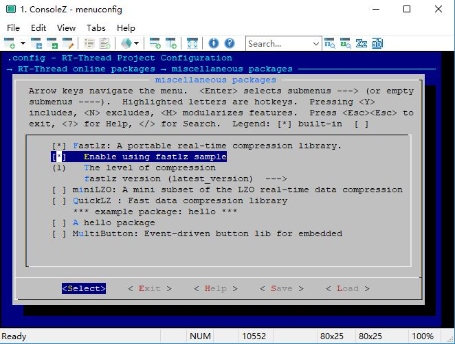
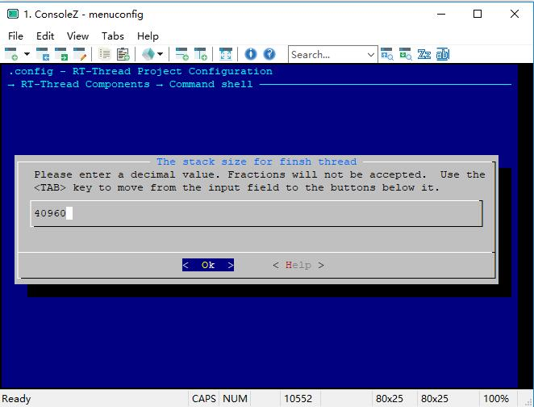

# QuickLZ

## 1、介绍

FastLZ 是一个快速无损压缩库， 仅包含两个文件， 使用简单， 易于集成。 这个 [FastLZ](https://github.com/RT-Thread-packages/fastlz) 库是 RT-thread 针对官方[FastLZ](http://fastlz.org/download.htm)的C库的移植， 有关 fastlz 的更多信息，请参阅[http://fastlz.org/index.html](http://fastlz.org/index.html) 。

## 2、获取方式

-  Git方式获取：
`git clone https://github.com/RT-Thread-packages/fastlz.git`

- env工具辅助下载：
  menuconfig package path：`RT-Thread online package` -> `miscellaneous package` -> `Fastlz`

## 3、示例介绍

### 3.1 获取示例

- 配置使能示例选项 `Enable using fastlz sample`;
- 配置压缩等级选项，配置为level 1（有两种等级 1 or 2，level 1 压缩速度最快， level 2 压缩比大）;
- 配置包版本选为最新版 `latest_version` .

### 3.2 运行示例
该示例为一个简单的文件压缩和解压的例程，需要依赖文件系统，用到的命令有两个` -c`和 `-d`， `-c`命令压缩一个文件到另一个文件，`-d`命令解压一个文件到另一个文件。   
使用方式：  
msh cmd 压缩： `fastlz_test -c /file.bin /file.cmprs.bin`  
msh cmd 解压： `fastlz_test -d /file.cmprs.bin /file_dcmprs.bin`  

    msh />fastlz_test -c /file.bin /file.cmprs.bin
    [fastlz]compress start : >>>>>>>>>>>>>>>>>>>>>>>>>>>>>>>>>>>>>>>>>>>>>>>>>>>>>>>>>>>>>>>>>>>>>>>>
    [fastlz]compressed 469848 bytes into 363495 bytes , compression ratio is 77%!
    msh />
    msh />fastlz_test -d /file.cmprs.bin /file_dcmprs.bin
    [fastlz]decompress start : >>>>>>>>>>>>>>>>>>>>>>>>>>>>>>>>>>>>>>>>>>>>>>>>>>>>>>>>>>>>>>>>>>>>>>>>
    [fastlz]decompressed 363495 bytes into 469848 bytes !

## 4、常见问题

### 4.1 解压缩假死

  问题： 在 `msh` 中使用命令进行解压缩的时候， 会遇到解压缩过程中出现 `死机` 的情况  
  原因： FastLZ 代码中默认配置使用的内存空间比较大， 可能会超出 `msh` 线程的堆栈空间  
  解决方法：   
  使用 `menuconfig` 增加 `msh` 线程的堆栈空间   
    menuconfig package path：`RT-Thread Components` -> `command shell` -> `the stack size`

## 5、参考资料

- FastLZ 官方网站：[http://fastlz.org/index.html](http://fastlz.org/support.htm)
